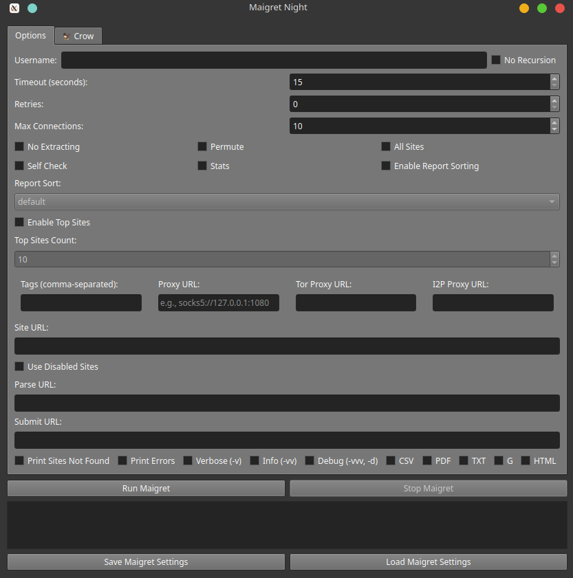

# maigret night

A GUI edition of the OSINT tool maigret, Full info can be [found here](https://github.com/soxoj/maigret/tree/main) along with the [docs](https://maigret.readthedocs.io/en/latest/quick-start.html) as this relies on the CLI as a backend, nothing much has changed in functions. Can also install it via a venv with 

    python -m venv venv && pip3 install maigret

# Install

    python3 -m venv venv && source /venv/bin/activate && pip3 install PyQt6




For blackbird (crow) you'll need to install it (git clone) inside this dir and it'll work.

For crow:

```
pip install -r requirements_GUI.txt && pip install -r requirements.txt
```


**Known false positives**

    ok.ru
    Chatango
    247CTF
    Znanija
    zhihu
    
    These are the results you need to look out for.
    
    Use libreoffice calc, use auto-filter.
    
    for the normies:
    
    cat!=political
    cat!=tech
    cat!=coding
    name!=ok.ru
    name!=Chatango
    name!=247CTF
    name!=Znanija
    name!=zhihu
    name!=Telegram
    name!=Gravatar
    name!=Trello
    name!=weebly
    name!=Etoro
    name!=Lemon8
    name!=gumroad
    name!=Bandcamp
    name!=smule
    name!=Houzz
    name!=Polarsteps
    name!=Wattpad
    name!=redbubble

# URI for spaced website names:

    uri_check!=https://api.tracker.gg/api/v2/apex/standard/profile/origin/{account}
    uri_check!=https://gitlab.archlinux.org/api/v4/users?username={account}
    uri_check!=https://archiveofourown.org/users/{account}
    uri_check!=https://forum.arduino.cc/u/{account}.json
    uri_check!=https://projecthub.arduino.cc/{account}
    uri_check!=https://artistsnclients.com/people/{account}
    uri_check!=https://community.avid.com/members/{account}/default.aspx
    uri_check!=https://www.bigo.tv/user/{account}
    uri_check!=https://bio.site/{account}
    uri_check!=https://bsky.app/profile/{account}
    uri_check!=https://public.api.bsky.app/xrpc/app.bsky.actor.getProfile?actor={account}.bsky.social
    uri_check!=https://app.buymeacoffee.com/api/v1/check_availability
    uri_check!=https://www.codeproject.com/Members/{account}
    uri_check!=https://community.adobe.com/t5/forums/searchpage/tab/user?q={account}
    uri_check!=https://www.dailykos.com/user/{account}
    uri_check!=https://discord.com/api/v9/invites/{account}?with_counts=true&with_expiration=true
    uri_check!=https://discord.com/api/v9/unique-username/username-attempt-unauthed
    uri_check!=https://hub.docker.com/v2/orgs/{account}/
    uri_check!=https://hub.docker.com/v2/users/{account}/
    uri_check!=https://www.donationalerts.com/api/v1/user/{account}/donationpagesettings
    uri_check!=https://community.evocms.ru/users/?search={account}
    uri_check!=https://expressional.social/api/v1/accounts/lookup?acct={account}
    uri_check!=https://federated.press/api/v1/accounts/lookup?acct={account}
    uri_check!=https://filmot.com/channelsearch/{account}
    uri_check!=https://filmot.com/unlistedSearch?channelQuery={account}&sortField=uploaddate&sortOrder=desc&
    uri_check!=https://www.fodors.com/community/profile/{account}/forum-activity
    uri_check!=https://fortnitetracker.com/profile/all/{account}
    uri_check!=https://fosstodon.org/api/v1/accounts/lookup?acct={account}
    uri_check!=https://freelancehunt.com/en/employer/{account}.html
    uri_check!=https://freelancehunt.com/en/freelancer/{account}.html
    uri_check!=https://www.furaffinity.net/user/{account}/
    uri_check!=https://gamejolt.com/site-api/web/profile/@{account}/
    uri_check!=https://gamerdvr.com/gamer/{account}
    uri_check!=https://connect.garmin.com/modern/profile/{account}
    uri_check!=https://genius.com/artists/{account}
    uri_check!=https://genius.com/{account}
    uri_check!=https://giphy.com/channel/{account}
    uri_check!=https://api.github.com/users/{account}/gists
    uri_check!=https://gitlab.gnome.org/api/v4/users?username={account}
    uri_check!=https://extensions.gnome.org/accounts/profile/{account}
    uri_check!=https://graphics.social/api/v1/accounts/lookup?acct={account}
    uri_check!=https://greasyfork.org/en/users?q={account}
    uri_check!=https://freelance.habr.com/freelancers/{account}/employer
    uri_check!=https://freelance.habr.com/freelancers/{account}
    uri_check!=https://qna.habr.com/user/{account}
    uri_check!=https://news.ycombinator.com/user?id={account}
    uri_check!=https://hcommons.social/api/v1/accounts/lookup?acct={account}
    uri_check!=https://historians.social/api/v1/accounts/lookup?acct={account}
    uri_check!=https://hometech.social/api/v1/accounts/lookup?acct={account}
    uri_check!=https://hostux.social/api/v1/accounts/lookup?acct={account}
    uri_check!=https://independent.academia.edu/{account}
    uri_check!=https://imginn.com/{account}/
    uri_check!=https://archive.org/advancedsearch.php?q={account}&output=json
    uri_check!=https://forum.ixbt.com/users.cgi?id=info:{account}
    uri_check!=https://joemonster.org/bojownik/{account}
    uri_check!=https://lcwo.net/api/user_exists.php
    uri_check!=https://libretooth.gr/api/v1/accounts/lookup?acct={account}
    uri_check!=https://lor.sh/api/v1/accounts/lookup?acct={account}
    uri_check!=https://malpedia.caad.fkie.fraunhofer.de/actor/{account}
    uri_check!=https://mapstodon.space/api/v1/accounts/lookup?acct={account}
    uri_check!=https://www.massageanywhere.com/profile/{account}
    uri_check!=https://masto.nyc/api/v1/accounts/lookup?acct={account}
    uri_check!=https://mastodon.social/api/v2/search?q={account}&limit=1&type=accounts
    uri_check!=https://mastodonbooks.net/api/v1/accounts/lookup?acct={account}
    uri_check!=https://mcname.info/en/search?q={account}
    uri_check!=https://playerdb.co/api/player/minecraft/{account}
    uri_check!=https://www.meetme.com/{account}
    uri_check!=https://minecraftlist.com/players/{account}
    uri_check!=https://www.moddb.com/html/scripts/autocomplete.php?a=username&q={account}
    uri_check!=https://moto-trip.com/profil/{account}
    uri_check!=https://muckrack.com/{account}
    uri_check!=https://musician.social/api/v1/accounts/lookup?acct={account}
    uri_check!=https://blog.myfitnesspal.com/author/{account}/
    uri_check!=https://community.myfitnesspal.com/en/profile/{account}
    uri_check!=https://api.niftygateway.com/user/profile-and-offchain-nifties-by-url/?profile_url={account}
    uri_check!=https://nitecrew.rip/api/v1/accounts/lookup?acct={account}
    uri_check!=https://onlysearch.co/api/search?keyword={account}
    uri_check!=https://wiki.openstreetmap.org/w/api.php?action=query&format=json&list=users&ususers={account}
    uri_check!=https://www.ourfreedombook.com/{account}
    uri_check!=https://patriots.win/u/{account}/
    uri_check!=https://psnprofiles.com/xhr/search/users?q={account}
    uri_check!=https://pollev.com/proxy/api/users/{account}
    uri_check!=https://www.pornhub.com/pornstar/{account}
    uri_check!=https://www.pornhub.com/users/{account}
    uri_check!=https://poweredbygay.social/api/v1/accounts/lookup?acct={account}
    uri_check!=https://discuss.privacyguides.net/u/{account}.json
    uri_check!=https://queer.pl/user/{account}
    uri_check!=https://rf-archive.com/users.php?s_tag={account}
    uri_check!=https://speakerdeck.com/{account}/
    uri_check!=https://api.sports-tracker.com/apiserver/v1/user/name/{account}
    uri_check!=http://www.tf2items.com/id/{account}/
    uri_check!=https://tilde.zone/api/v1/accounts/lookup?acct={account}
    uri_check!=https://tooting.ch/api/v1/accounts/lookup?acct={account}
    uri_check!=https://truthsocial.com/api/v1/accounts/lookup?acct={account}
    uri_check!=https://uefconnect.uef.fi/en/{account}/
    uri_check!=https://www.ultimate-guitar.com/u/{account}
    uri_check!=http://ultrasdiary.pl/u/{account}/
    uri_check!=https://unlistedvideos.com/search.php?user={account}
    uri_check!=https://usa.life/{account}
    uri_check!=https://vkl.world/api/v1/accounts/lookup?acct={account}
    uri_check!=https://vmst.io/api/v1/accounts/lookup?acct={account}
    uri_check!=https://public-api.wordpress.com/rest/v1.1/sites/{account}.wordpress.com
    uri_check!=https://public-api.wordpress.com/rest/v1.1/sites/{account}.wordpress.com
    uri_check!=https://public-api.wordpress.com/rest/v1.1/sites/{account}.wordpress.com
    uri_check!=https://login.wordpress.org/wp-json/wporg/v1/username-available/{account}
    uri_check!=https://login.wordpress.org/wp-json/wporg/v1/username-available/{account}
    uri_check!=https://www.xboxgamertag.com/search/{account}
    uri_check!=https://auctions.yahoo.co.jp/follow/list/{account}
    uri_check!=https://www.youtube.com/c/{account}/about
    uri_check!=https://www.youtube.com/user/{account}/about
    uri_check!=https://www.youtube.com/@{account}
    uri_check!=https://archive.org/wayback/available?url=https://www.fotolog.com/{account}
    uri_check!=http://archive.org/wayback/available?url=https://parler.com/profile/{account}/posts
    uri_check!=http://archive.org/wayback/available?url=https://parler.com/profile/{account}
    uri_check!=https://archive.org/wayback/available?url=https://www.taringa.net/{account}
    uri_check!=http://archive.org/wayback/available?url=https://twitter.com/{account}
    uri_check!=http://archive.org/wayback/available?url=https://twitter.com/{account}/status/*

Not many people use telegram as that is a secure chat app; still do you own due diligence.

Read blackbirds git [here](https://github.com/p1ngul1n0/blackbird) | markdown on shell [scripting](https://app.radicle.xyz/nodes/iris.radicle.xyz/rad:zXuj4JY6cW16dn6usB9c9wuGJkBR/tree/markdown/scripts.md) your gonna need it.

Feel free to check out this [filter list](https://gist.github.com/airborne-commando/378af481b35edd3be53f3bc7f24724a1), defaulted to `=`


Do a dry run first, get an idea of what the person is into; then sort in blackbird et al and refine steps.

[Most Popular Messaging Apps - exploding topics (Duarte. October 14, 2025)](https://explodingtopics.com/blog/messaging-apps-stats)

[9 Best Secure Messaging Apps for Business Leaders and Employees - JWU (Upated March 21, 2025)](https://online.jwu.edu/blog/9-best-secure-messaging-apps-business-leaders-and-employees/)

[What my name database](https://github.com/WebBreacher/WhatsMyName/blob/main/wmn-data.json)